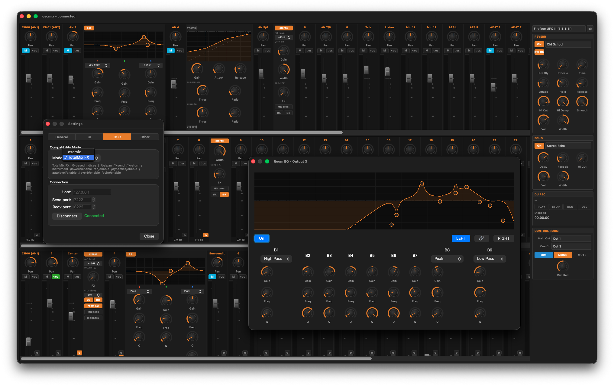

[](https://github.com/huddx01/oscmix/actions/workflows/build.yml)

Hi, you have reached my dev branch which is a fork of https://github.com/michaelforney/oscmix.

> [!NOTE]
> My branch is NOT sponsored, authorized, endorsed, or associated with RME Audio in any way. This is an independent implementation created for educational purposes and to provide Linux (and macOS) support for the RME hardware.

> [!WARNING]
> Keep in mind that this content may be untested/experimental/wip state.
# oscmix
 
oscmix implements an OSC API for some RME's Fireface units running in
class-compliant mode, allowing full control of the device's
functionality through OSC on POSIX operating systems supporting USB
MIDI.

## Current status

Most things work, but still needs a lot more testing, polish,
cleanup. Some things still need to be hooked up in the UI or
implemented in oscmix.

### Supported devices

- RME Fireface UCX II

### Devices in WIP State

- RME Fireface 802
- RME Fireface UCX
- RME Fireface UFX+
- RME Fireface UFX II
- RME Fireface UFX III


## Download

Pre-Compiled binaries are available for arm64 and x86_64 architectures.
Each arch is available for linux and darwin (macOS).

Check the release section at: https://github.com/huddx01/oscmix/releases

## Building

If you prefer building your own from the sources, follow the steps below...

### 1. Install Dependencies

#### For Debian/Ubuntu:
```shell
sudo apt update
sudo apt install -y libasound2-dev pkg-config libgtk-3-dev libglib2.0-dev libavahi-client-dev clang lld git
```
#### For Darwin(macOS):
Xcode Command Line Tools or Xcode are required. Bonjour (mDNS) is built into macOS.

```sh
xcode-select --install
```

### 2. Download Repository
First, decide which repo/branch fits your needs/unit.

- 2a) If you want use this repo's dev branch:
```shell
git clone https://github.com/huddx01/oscmix.git
cd oscmix
git switch dev
```
- 2b) Or, if you want use 
[michaelforney](https://github.com/michaelforney)'s original repo: 
```shell
git clone https://github.com/michaelfourney/oscmix.git
cd oscmix
```

### 3. Build
From the oscmix dir, use make to build the binaries.
```shell
make oscmix
make alsaseqio
make alsarawio
make gtk
make tools/regtool
```
If you want to build the wasm too (needed for own webserver), you'll need additional dependencies. 
See: https://github.com/huddx01/oscmix/tree/dev?tab=readme-ov-file#web-ui

## General Oscmix Usage

```
oscmix [-dhlz] [-m [port]] [-p midiport] [-r recvaddr] [-s sendaddr]
```

oscmix reads and writes MIDI SysEx messages from/to file descriptors
6 and 7 respectively, which are expected to be opened by `alsarawio`,
`alsaseqio` (Linux) or `coremidiio` (macOS).

By default, oscmix will listen for OSC messages on `udp!127.0.0.1!7222`
and send to `udp!127.0.0.1!8222`.

| Flag | Description |
|------|-------------|
| `-d` | Enable debug output |
| `-h` | Show help and exit |
| `-l` | Disable level metering |
| `-m [port]` | Send OSC updates to multicast address `224.0.0.1` on given port (default: `8222`) |
| `-p midiport` | MIDI port name (default: `$MIDIPORT` env var) |
| `-r addr` | OSC receive address (default: `udp!127.0.0.1!7222`) |
| `-s addr` | OSC send address (default: `udp!127.0.0.1!8222`) |
| `-z` | Zeroconf - Register OSC service via mDNS/DNS-SD (`_osc._udp`) for automatic service discovery |

See the manual pages for more information: `man oscmix`, `man alsaseqio`, `man alsarawio`, `man coremidiio`.

### mDNS / DNS-SD Discovery

When started with `-z`, oscmix registers itself as an `_osc._udp` service on the local network.
On Linux this uses [Avahi](https://avahi.org); on macOS Bonjour is used (no extra dependencies).

mDNS / DNS-SD Discovery Implementation is based and according the [OSC v.1.1 spec](https://ccrma.stanford.edu/groups/osc/spec-1_1.html).
For details see [NIME 2009 paper](https://ccrma.stanford.edu/groups/osc/files/2009-NIME-OSC-1.1.pdf).

The registered service includes device metadata (name, serial, channel count, ports) so that
compatible clients — including the oscmix Qt UI — can discover and connect automatically
without manual IP/port configuration.

```sh
# Start with multicast output and mDNS registration
alsaseqio 16:3 oscmix -m -z

# Use a custom multicast port
alsaseqio 16:3 oscmix -m 8233 -z

# Verify registration on Linux
avahi-browse _osc._udp

# Verify registration on macOS
dns-sd -B _osc._udp local
```

## Running

### Linux

On Linux systems, you can use alsarawio or asaseqio to run oscmix.

#### 1. alsarawio

On Linux systems, you can use bundled `alsarawio` program open and
configure a given raw MIDI subdevice and set up these file descriptors
appropriately.

To determine your MIDI device, look for it in the output of `amidi -l`.
(the last ending port with the name `Fireface xyz...`).

Example:

```sh
$ amidi -l
Dir Device    Name
IO  hw:0,0,0  Fireface UFX III (xxxxxxxx) Por
IO  hw:0,0,1  Fireface UFX III (xxxxxxxx) Por
IO  hw:0,0,2  Fireface UFX III (xxxxxxxx) Por
IO  hw:0,0,3  Fireface UFX III (xxxxxxxx) Por
```

We use the last port from the result above to run oscmix:

```sh
alsarawio 0,0,3 oscmix
```


#### 2. alsaseqio

There is also a tool `alsaseqio` that requires alsa-lib and uses
the sequencer API.

To determine the client and port for your device, find the client
and the last port in the output of `aconnect -l` for your device.

Example:
```sh
$ aconnect -l
...
client 16: 'Fireface UFX III (xxxxxxxx)' [type=Kernel,card=0]
    0 'Fireface UFX III (xxxxxxxx) Por'
    1 'Fireface UFX III (xxxxxxxx) Por'
    2 'Fireface UFX III (xxxxxxxx) Por'
    3 'Fireface UFX III (xxxxxxxx) Por'
...
```
We use the client and last port from the result above to run oscmix:
```sh
alsaseqio 16:3 oscmix
```

With multicast output and mDNS registration:
```sh
alsaseqio 16:3 oscmix -m -z
```

### BSD

On BSD systems, you can launch oscmix with file descriptors 6 and
7 redirected to the appropriate MIDI device.

For example:

```sh
oscmix 6<>/dev/rmidi1 7>&6
```

### macOS (Darwin)

On macOS (Darwin) systems, you can build and launch oscmix, too.

At least, Xcode Command Line Tools are neccesary (not needed if you have Xcode installed). 

You can install the Xcode Command Line Tools via:

```sh
xcode-select --install
```

Afterwards, go to the cloned oscmix directory (assure you are on dev branch) and build oscmix and coremidiio via:

```sh
make oscmix coremidiio
```

If this is done, check your port number and remember the exact name of your unit:

```sh
./coremidiio -l
```

For example, if your unit would appear like this...
"4  	Fireface 802 (12345678) Port 2"
...the corresponding command would be:

```sh
./coremidiio -f 6,7 -p 4 ./oscmix -p 'Fireface 802 (12345678) Port 2'
```

> [!NOTE]
> You can also set MIDIPORT env variable to 'Fireface 802 (12345678) Port 2' in this example.

With multicast output and mDNS registration:

```sh
./coremidiio -f 6,7 -p 4 ./oscmix -m -z
```


## GTK UI

The [gtk](gtk) directory contains oscmix-gtk, a GTK frontend that
communicates with oscmix using OSC.


### Running GTK UI
To run oscmix-gtk without installing, set the `GSETTINGS_SCHEMA_DIR`
environment variable.

```sh
GSETTINGS_SCHEMA_DIR=$PWD/gtk ./gtk/oscmix-gtk
```

## Qt UI *(Early WIP)*

> [!NOTE]
> This is a first rough draft after only a few days of learning Qt - expect rough edges.
> Sources will follow once it's in a shareable state.
> 
> NEW: A pre-built binary (for first try-out) is available in the [Releases](https://github.com/huddx01/oscmix/releases)
> 
> For a current feature description see the [oscmix Qt UI wiki page](https://github.com/huddx01/oscmix/wiki/oscmixQt)



### Why Qt?

- **Native experience** - proper window chrome, system fonts, and trackpad scrolling that GTK can't match on Linux and macOS
- **Universal Code** - no change of one single code line needed for building on each system (Linux/macOS/Windows). While the UI exacly looks the same on all. 
- **Open GL/Metal** - Qt supports direct graphics engine support for all systems, without further hassles...

### Your input wanted

This frontend is at the stage where your feedback shapes the direction. Two things are especially useful right now:

1. **What matters to you in the UI?** Missing controls, layout preferences, workflow details - just open an issue.
2. **GTK vs. Qt priority?** Development time is finite. If you actively use or plan to use the Qt frontend, let me know via issue - it directly influences where time goes.

## Web UI

The [web](web) directory contains a web frontend that can communicate
with oscmix through OSC over a WebSocket, or by directly to an
instance of oscmix compiled as WebAssembly running directly in the browser.


The web UI for this fork/dev branch is automatically deployed at
[https://huddx01.github.io/oscmix](https://huddx01.github.io/oscmix).

It is tested primarily against the chromium stable channel, but
patches to support other/older browsers are welcome (if it doesn't
complicate things too much).

Also included is a UDP-to-WebSocket bridge, `wsdgram`. It expects
file descriptors 0 and 1 to be an open connection to a WebSocket
client. It forwards incoming messages to a UDP address and writes
outgoing messages for any UDP packet received. Use it in combination
with software like [s6-tcpserver] or [s6-tlsserver].

```sh
s6-tcpserver 127.0.0.1 8222 wsdgram
```

To build `oscmix.wasm`, you need `clang` supporting wasm32, `wasm-ld`,
and `wasi-libc`.

[s6-tcpserver]: https://skarnet.org/software/s6-networking/s6-tcpserver.html
[s6-tlsserver]: https://skarnet.org/software/s6-networking/s6-tlsserver.html

## OSC API

For current state of full OSC API reference, see the [oscmix OSC API](https://github.com/huddx01/oscmix/wiki/oscmix-OSC-API) wiki page.

## Thanks

- [@juanramoncastan](https://github.com/juanramoncastan) - UFX II verifications, UI improvements, layout fixes and valuable suggestions ([#5](https://github.com/huddx01/oscmix/issues/5))

- [@Sojuzstudio](https://github.com/Sojuzstudio) - Special thanks - for lots of tipps, ideas, testing with own hw on linux, and very useful feedback regarding oscmixQt UI and much more!
